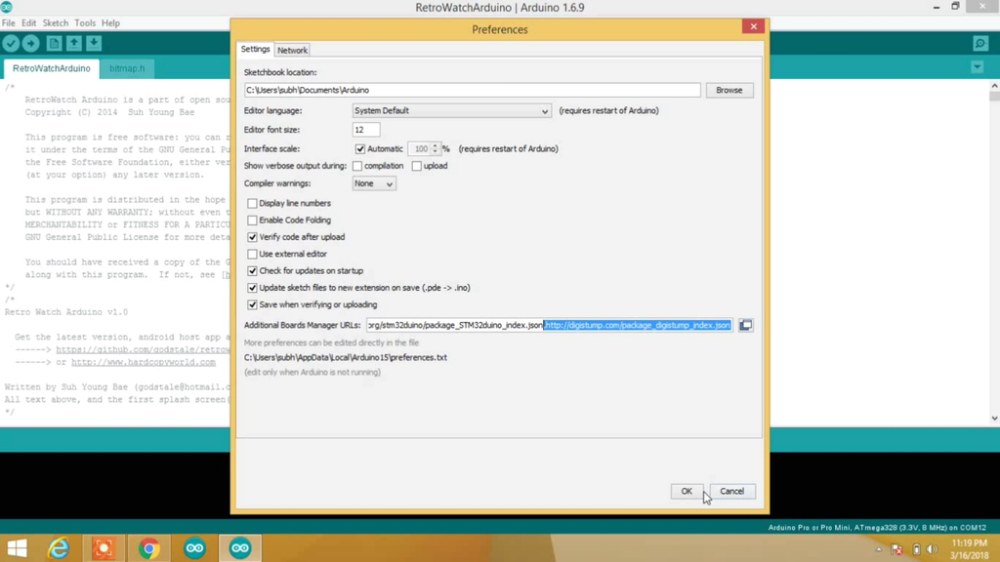

# Lighthouse Project

Project of illumination of this [lighthouse](https://www.etsy.com/it/listing/823327425/papercraft-con-lisola-craft-con-la-carta?ga_order=most_relevant&ga_search_type=all&ga_view_type=gallery&ga_search_query=swastik3d&ref=sr_gallery-1-2&dd=1&organic_search_click=1) using a Digispark based on [Attiny 85](https://www.microchip.com/en-us/product/attiny85) using Arduino IDE

Here you can find [pinout](datasheet/Digispark%20Pinout.pdf) and the [datasheet](datasheet/Digispark%20Datasheet.pdf)

## Description

This circuit uses 6 leds fading between them to simulate a rotation.

The potentiometer regulates the rotation speed between the leds.

## Installation of Digispark

- Open Arduino IDE
- Open *Preferences*
- In *Additional Board Manager URLs* paste this link [http://digistump.com/package_digistump_index.json](http://digistump.com/package_digistump_index.json) as this  
- Now go to *Tools* -> *Board* -> *Board Manager* and search for **Digistump AVR Boards** and install it. It'll require to install a custom windows driver
- After installation select the board *Digispark (Default - 16.5mhz)*

Connect the board **only** when it's required by the uploader

## Schematic

Here you can find the [BOM](circuit/bom.csv) and the [schematic](circuit/schematic.pdf)

## Code

The arduino code is [here](lighthouse.ino/)
